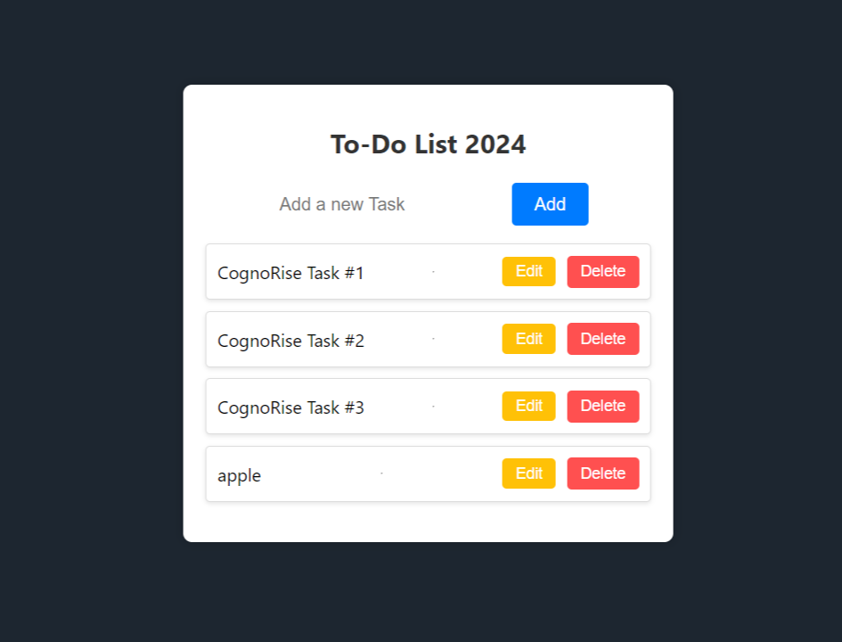

# :closed_book: TASK #1 TODO-LIST 

### _as an internee at CognoRiseInfotech !!_

### Link :link: https://cognorise-todo.netlify.app/

## Interface

## Run Locally

  - Run This command `https://github.com/developer-rak/CognoRise_To-Do-List.git`
  - You are now in the dev environment and you can play around

## ✨ Features

  - To add items
  - can edit items
  - can delete items
  - items will be stored in localStorage
  - Open Source (Tweak it and use it)

## ⚙️ Tech Stack
  - HTML5
  - CSS
  - JAVASCRIPT
  - Netlify
